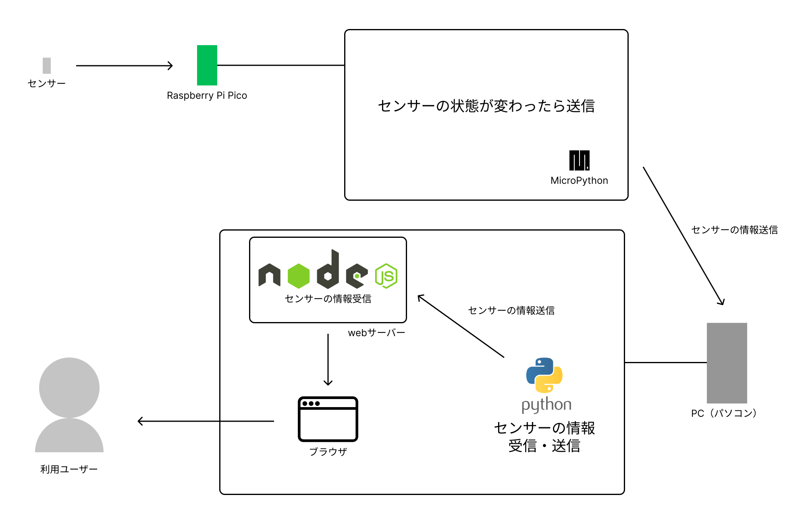
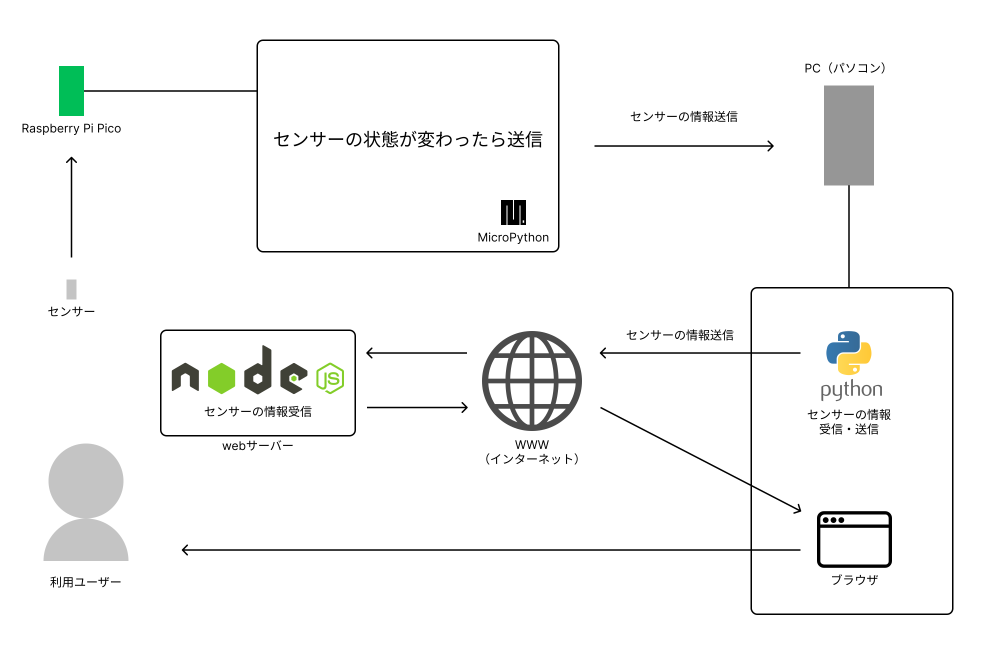

### [戻る](./../process.md)

# 基本設計

## システム構成図

### ローカル完結の場合

### web サーバー公開済みの場合

  

## テーブル定義

- status テーブル
- names テーブル
- categories テーブル

  

## 機能一覧

- センサー登録
- 開閉状態の受け取り
- 開閉状態の送信
- 開閉状態のリアルタイム表示

  

## デザイン

- パッと見て開閉状態が分かる

  

## 費用

- Raspberry Pi Pico
  - 572+200(送料)
    - https://www.switch-science.com/catalog/6900/
- センサー（リードスイッチ）
  - 815
    - https://www.amazon.co.jp/dp/B07FLWGS73/

合計：1587 円

  

### 参考リンク

- https://bizroute.net/system_development_template.html
