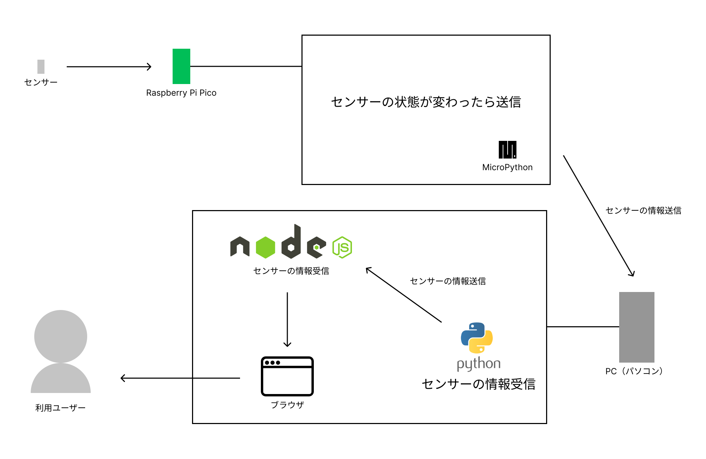

### [戻る](./../process.md)

# 基本設計

## システム構成図

  

## テーブル定義

### status テーブル

| name       | type      | 用途     |
| ---------- | --------- | -------- |
| id         | INTEGER   |          |
| body       | BOOLEAN   | 開閉状態 |
| created_at | TIMESTAMP | 変更時間 |

  

## 機能一覧

- センサー読み込み・受け取り
- 開閉状態のリアルタイム表示

  

## デザイン

### 案 1

### 案 2

  

## 費用

- Raspberry Pi Pico
  - 572+200(送料)
    - https://www.switch-science.com/catalog/6900/
- センサー（リードスイッチ）
  - 815
    - www.amazon.co.jp/dp/B07FLWGS73

合計：1587 円

  

### 参考リンク

- https://bizroute.net/system_development_template.html
