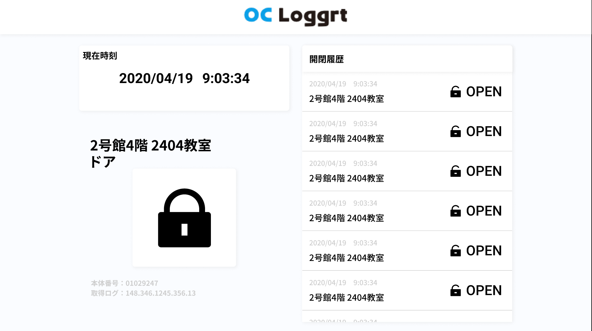

### [戻る](./../process.md)

# 詳細設計

## テーブル定義

---

### status テーブル

| name       | type      | 用途            |
| ---------- | --------- | --------------- |
| id         | INTEGER   |                 |
| body       | BOOLEAN   | 開閉状態        |
| created_at | TIMESTAMP | 変更時間        |
| name_id    | INTEGER   | 外部キー(names) |

---

### names テーブル

| name        | type    | 用途                 |
| ----------- | ------- | -------------------- |
| id          | INTEGER |                      |
| body        | TEXT    | 名前                 |
| category_id | INTEGER | 外部キー(categories) |

---

### categories テーブル

| name | type    | 用途       |
| ---- | ------- | ---------- |
| id   | INTEGER |            |
| body | TEXT    | カテゴリ名 |

---

  

## デザイン

このサービスで知らせたいことは、以下の3つになります。  
「いつ （何時から何時など） 」「どこで（ドアや窓が）」「どういう状態なのか、（開いてるのか、閉まってるのか）」  
- 起動した時にこの3つが瞬時にわかるように、一番大きいフォントサイズで時間と場所を表示させ、開閉はアイコンにすることでより瞬時に理解できるようにしました。
- そして履歴は量が多くなることが予想されるので、右側で独立させ増減に耐えられる用にと左側の左から右という人間の視線の動きに合わせることで読む際のストレスを減らしました。

### 案 1

### 案 2

  

## 機能一覧

[機能一覧](./function.md)
